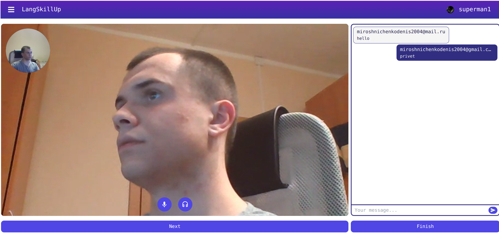
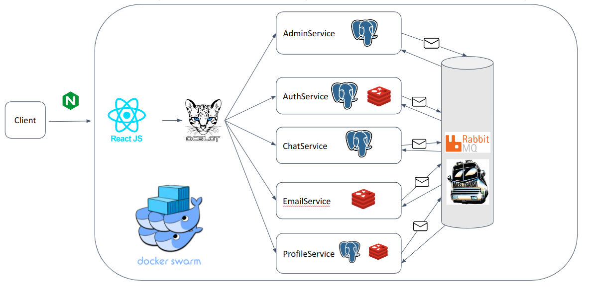

# LangSkillUp 💬

## Course work 👨‍🎓

### :star: Nominated as one of the best projects at the Faculty of Computer Science of the National Research University Higher School of Economics :star:

## Legend

**How often do you hang out in chat roulette?**

## Description

The web application “Chat Roulette “LangSkillUp”” implements the mechanics of Chat Roulette, providing users with the opportunity to communicate in English language through video communication (the main type of communication) and text chat (an auxiliary type of communication). The built-in game mechanics will allow you to develop communication skills in English language.



## What I use to implement all of this?

### Backend

- .NET
- EF Core
- Dapper
- Redis
- RabbitMQ with MassTransit library
- Serilog for structure logging
- Amazon S3
- Jenkins / GitHub Actions for CI/CD pipelines
- SignalR for realtime communication
- Quartz for background jobs
- Ocelot
- Docker Swarm for orchestration

## Architecture

```
AdminService: Only for admin purposes
1) Check user complaints
2) Ban users
3) Check feedbacks

AuthService:
1) SignUp
2) Login
3) Logout
4) Generate refresh token

ChatService:
1) WebSockets communication
2) Storage communication users, chat group
3) Implementing card games

EmailService:
1) Submit email
2) Notify that user is submitted

ProfileService: all core features
1) Calculation user rating after talkings
2) Friends features
3) Edit profile features
4) Upload avatars
5) Getting history, user information, invitations 
   to friends

```



```html
Also this project implements Domain Driven Design 
principles

We use WebRTC for send video traffic through 
the Internet. 
Everything works fine, but due to the fact
that we use free stun servers, video traffic is
not always delivered to recipients. If you liked 
the concept of this application, then click on the 
star in the repository and after 15 likes I will 
launch the application with paid servers for video
traffic.
```

<a href="https://getstream.io/glossary/turn-server/#:~:text=TURN%20and%20STUN%20servers%20are,Session%20Traversal%20Utilities%20for%20NAT." style="font-size: small;">Click here for more details on TURN and STUN servers</a>

### Status last build:</br>

###  </br>

*Copyleft By Denis Miroshnichenko 2024*
